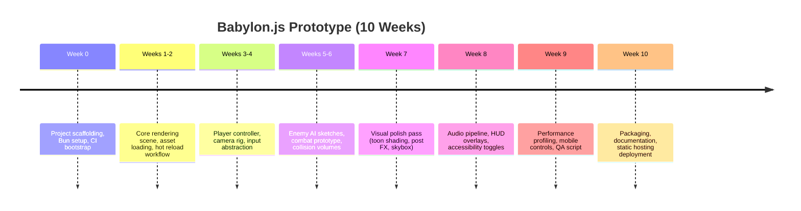

# Babylon.js Prototype Plan

## Framing the Experiment
This initiative targets a lightweight action-adventure prototype delivered entirely in the browser. The stack centers on **Babylon.js** for rendering, **TypeScript** for strong typing and tooling, and the **Bun** runtime to streamline local development, testing, and packaging scripts. The assumption is a single developer already fluent with modern web tooling and comfortable shipping WebGL applications. If that assumption slips, expect the schedule to expand or the scope to narrow.

## Project Aspirations
- **Cinematic WebGL presentation** that blends toon-shaded meshes with sprite billboards to echo the HD-2D feel of the Rust prototype.
- **Instant iteration loops** using Bun’s fast bundler, hot module reload, and integrated test runner so that art and gameplay tweaks are visible within seconds.
- **Responsive controls** tuned for keyboard, gamepad, and touch, leveraging Babylon’s input observables and Web APIs.
- **Accessible deployment** where the prototype lives behind a single static build command and can be hosted on platforms like Vercel, Cloudflare Pages, or GitHub Pages.
- **Extensible architecture** constructed around ECS-inspired scene graphs, making it straightforward to add encounters, quests, or alternate biomes later.

## Definition of Success
Success looks like a player entering the browser build and immediately exploring a stylized diorama: animated hero, reactive enemies, parallax scenery, and atmospheric audio. The build must load quickly, render at 60 FPS on modern laptops and tablets, and degrade gracefully on lower-end hardware. A Bun-powered CLI should bundle, lint, test, and deploy the project with predictable output. Documentation must capture setup steps, architectural decisions, and future hooks so that collaborators can spin up without hand-holding.

## Technical Backbone
Babylon.js supplies the rendering engine, physics helpers, asset pipelines, and post-processing framework. TypeScript definitions and decorators (where helpful) keep scenes typed and navigable. Bun’s runtime handles dependency installation, bundling, unit tests via `bun test`, and a custom dev server script wired to Babylon’s inspector for on-the-fly debugging.

Key supporting pieces:
- **Scene management** driven by a lightweight state machine (title screen → overworld → combat encounter) backed by observables.
- **Asset pipeline** using `.glb` exports for characters and props, `TexturePacker`-generated spritesheets for 2D elements, and procedural materials for terrain.
- **Tooling** including ESLint, Prettier, and typedoc, all invoked through Bun scripts.
- **Continuous deployment** via GitHub Actions that call Bun for install/build/test, pushing artifacts to a static host each merge to `main`.

## Workstreams at a Glance
- **Rendering & Visuals**: camera rig, shader graph, toon shading, particle effects, HDR pipeline.
- **World Systems**: tile/height-map authoring, lightweight pathfinding, data-driven biomes.
- **Gameplay & Controls**: character controller, enemy behaviors, combat/interaction loops.
- **Audio & UX**: adaptive soundtrack layers, spatialized SFX, HUD overlays, accessibility options.
- **Tooling & Delivery**: Bun scripts, configuration management, automated testing, deployment.

## Roadmap Overview

## Key Deliverables
- **Bun-powered project skeleton** with scripts for `dev`, `test`, `lint`, `build`, and `deploy`.
- **Playable vertical slice** demonstrating exploration, combat, and camera work inside a handcrafted biome.
- **Reusable component library** for Babylon entities (e.g., `CharacterAvatar`, `BillboardLayer`, `HitboxVolume`).
- **Shader suite** including toon ramps, outline passes, and particle materials.
- **Automation & CI** running linting, tests, and bundling on every pull request, publishing builds to a staging URL.
- **Documentation pack** consisting of setup instructions, architecture overview, coding standards, and backlog seeds for the next iteration.

## Risks Worth Watching
- **Web performance cliffs**: GPU overdraw or heavy particle systems can crush mobile browsers. Mitigation: profile early using Babylon’s inspector, cap draw calls, and offer quality presets.
- **Bun ecosystem churn**: the runtime evolves rapidly; pin versions and keep a Node fallback script if a dependency lags.
- **Asset pipeline complexity**: GLB exports and spritesheet generation can drift; enforce asset naming conventions and automate validation where possible.
- **Input variance**: gamepad support across browsers is inconsistent. Build abstraction layers, supply alternate bindings, and test on major browsers/devices weekly.

## Immediate Next Steps
1. Scaffold the repository (`bun init` + directory layout) and commit baseline configuration (ESLint, Prettier, TypeScript config, Bun scripts).
2. Integrate Babylon.js with a minimal scene, verifying hot reload, inspector access, and shader compilation under Bun.
3. Draft architecture notes (scene/state flow, component responsibilities) and log open questions for art and gameplay direction.
4. Establish CI workflow executing `bun install`, `bun test`, and `bun run build`, publishing artifacts to a staging host for review.
